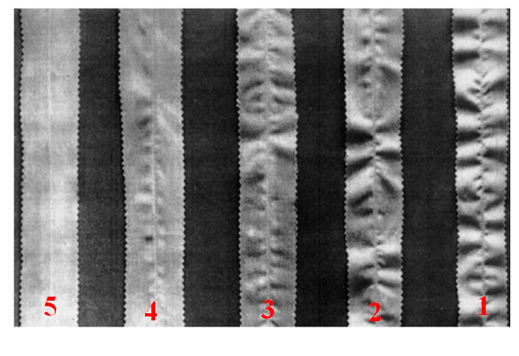
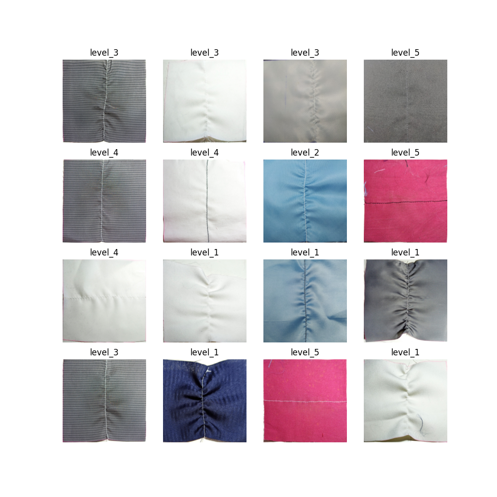

# SEAM PUCKERING CLASSIFICATION

## IDEA
This project is created to serve the purpose of classifying the puckering level based on ISO standard as below:

In this project, several models are used to trained and tested including:
* EfficientNet_B0
* RESNET50
* MobileNetV2
* VGG19
* VGG16

## STRUCTURE
* Folder 'ai': Contain code of notebook to train and test the models
* Folder 'app': Contains the code of building the application utilizing a model for classifying seam puckering job
* Folder 'sample_data': Containing some sample images for each seam puckering level for testing

## AN EXAMPLE OF SOME LABELED SAMPLE IMAGES
